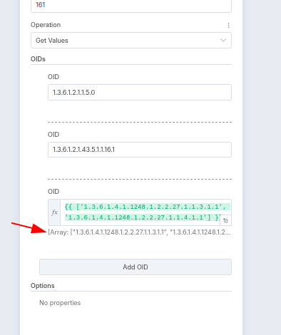

# n8n-nodes-snmp

This is an n8n community node. It lets you access SNMP-enabled devices in your n8n workflows.

SNPM is a network management protocol that is widely used to monitor and control network devices (e.g. routers and
switches), as well as other network-connected devices such as servers, IP phones and printers.

[n8n](https://n8n.io/) is a [fair-code licensed](https://docs.n8n.io/reference/license/) workflow automation platform.

[Installation](#installation)  
[Operations](#operations)  
[Credentials](#credentials)  
[Compatibility](#compatibility)  
[Resources](#resources)  
[Version history](#version-history)

## Installation

Follow the [installation guide](https://docs.n8n.io/integrations/community-nodes/installation/) in the n8n community
nodes documentation.

## Operations

### List OIDs

Retrieves a part of the device's MIB, starting at a certain root element. Similar in functionality to [the
`snmpwalk` command](https://linux.die.net/man/1/snmpwalk).

By default, this operation walks the subtree rooted at SNMPv2-SMI::mib-2 (`1.3.6.1.2.1`, or
`iso.org.dod.internet.mgmt.mib-2`), like `snmpwalk`. This should surface most standardized fields, but it'll leave out,
for example, any vendor-specific fields (which may be under `1.3.6.1.4.1`, the Private Enterprises section). This can be
configured with the advanced option **Root OID**.

### Get Values

Reads one or multiple OIDs. Static OIDs (or expressions that resolve to a single OID) can be written in the OIDs list.

If you need to read a variable list of OIDs (where the number of items isn't known and comes from an expression), add
an item to the list of OIDs and write an expression that resolves to an array. The node supports a mix of single and
multiple OIDs:

### Get Table

There are parts of MIB trees that contain table data (two-dimensional lists),
in [column-major order](https://en.wikipedia.org/wiki/Row-_and_column-major_order) (all the values for column A first,
then all the values for column B, and so on). For example, `1.3.6.1.2.1.2.2`
is [the interfaces table](https://oidref.com/1.3.6.1.2.1.2.2), comprised of all the values of the form
`<BASE_OID>.1.<COLUMN_INDEX>.<ENTRY_INDEX>`:

| ↓ ENTRY_INDEX | COLUMN_INDEX = 1 = ifIndex | COLUMN_INDEX = 2 = ifDescr | COLUMN_INDEX = 3 = ifType | ... |
|---------------|----------------------------|----------------------------|---------------------------|-----|
| 1             | 1                          | lo                         | 24                        | ... |
| 2             | 2                          | eth1                       | 6                         | ... |
| ...           |                            |                            |                           |     |

To read a table, provide the OID under which the table is stored. _Do not_ include the final `.1` that is typically (
always?) appended to it. This operation will return multiple output items, all with the same shape/schema (dictated by
the fields returned by the SNMP agent while listing all children of the Base OID)

### Write

It's possible to write values back to the SNMP agent. Which OIDs are writable and the data types of each depends on the
exact device that is being managed.

**NOTE:** For now, please note that data types are slightly awkward to handle. If you try to write to an OID that
accepts integers, for example, you can't just write `1` in the Value field, because it'll be interpreted as a string
with a single character. To force an actual number, switch the Value field to Expression mode and write `{{ 1 }}`, which
_will_ be treated as a proper number. String fields can be written directly (or as expressions too, for variable values)

## Trigger

### Trap Trigger

The SNMP Trap Trigger node opens a UDP port and listens to SNMP Traps (either v1 or v2) and Informs. Traps are
fire-and-forget and the sending agent won't have confirmation of their receipt, whereas Informs will be acknowledged by
N8N.

To use this node, optionally provide a credential (which will be used to check all incoming requests, so they must have
a certain community name or user info) and specify the port that the trigger will listen on. Please note that this port
must not already be in use because it'll be bound exclusively by the trigger, so you can't have multiple triggers (
whether on the same WF or on different WFs) using the same port. For the same reason, it isn't possible to run the WF
manually while it's active, because in that case both the running WF and the manual execution would try to bind to the
same port. To test the WF manually, deactivate it first, then test it, and then activate it again. Alternatively,
manually pin data on the trigger, or, if you have access to it, use
the [Debug in editor](https://docs.n8n.io/workflows/executions/debug/) button.

If you're deploying N8N in Docker, you may need to allow the container to bind to the desired ports by using
Docker's [port forwarding features](https://docs.docker.com/get-started/docker-concepts/running-containers/publishing-ports/) (
or use a range of ports,
as [some Dockerized FTP servers](https://github.com/garethflowers/docker-ftp-server?tab=readme-ov-file#-via-docker-run)
suggest doing)

## Credentials

This node supports the authentication methods of SNMP v1, v2c (both just use a Community Name) and v3 (username and,
optionally, separate passwords for message authentication and encryption).

The node can also be used without a credential, in which case it'll default to v2c with the community `public`. To use
v1 or v3, provide a credential (which is necessary in any case for v3 because there isn't a v3 equivalent to the
`public` community that is very widely used in v1/v2c).

## Compatibility

This node has been developed in N8N v1.111. It should work on somewhat older versions (released a few months ago before
2025-09). Please [open an issue](https://github.com/jreyesr/n8n-nodes-snmp/issues) if you encounter any problems.

## Resources

* [n8n community nodes documentation](https://docs.n8n.io/integrations/#community-nodes)
* [The underlying library used](https://www.npmjs.com/package/net-snmp)

## Version history

See [the CHANGELOG.md file](./CHANGELOG.md)